# OpenWrt on VirtualBox
## 实验过程
### 网络拓扑
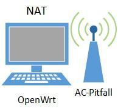
### 获得OpenWrt虚拟硬盘文件
```bash
# 以下命令在wsl中执行

# 下载镜像文件
wget https://downloads.openwrt.org/releases/18.06.4/targets/x86/64/openwrt-18.06.4-x86-64-combined-squashfs.img.gz # 也可以直接前往官网下载
# 解压缩
gzip openwrt-18.06.4-x86-64-combined-squashfs.img.gz

# 直接将解压出来的.img文件转化为.vdi文件会出现VERR_VD_INVALID_SIZE错误, 需要先用dd(主要功能为转换和复制文件)填充
dd if=openwrt-18.06.4-x86-64-combined-squashfs.img of=openwrt-18.06.4.img bs=128000 conv=sync
# bs: 输入/输出块大小为128000字节
# conv=sync: 将每个输入块填充到128000字节, 不足部分用空(NUL)字符补齐

VBoxManage convertfromraw --format VDI openwrt-18.06.4.img openwrt-18.06.4.vdi
# 调整至合适的大小, 在此之前需要在虚拟机上注册该虚拟硬盘
VBoxManage modifymedium openwrt-18.06.4.vdi --resize 128
```
### 虚拟机配置
- 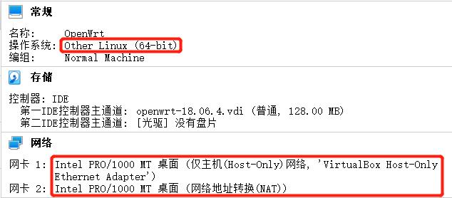
- 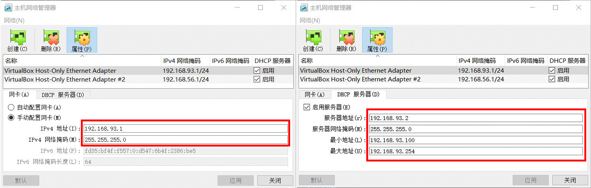
- 修改`/etc/config/network`配置信息(除了修改ipaddr还删除了接口`'wan6'`的配置):<br>
  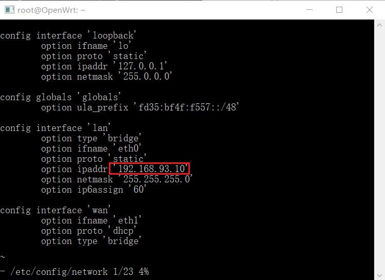<br>
  `lan`端口只支持静态配置IP
- 安装好`luci`后即可访问:<br>
  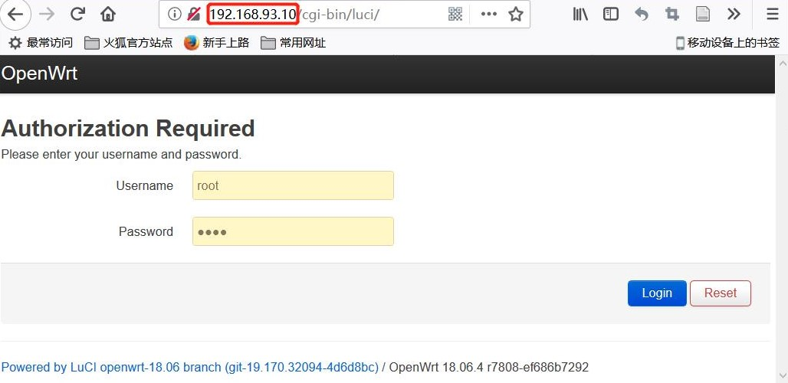<br>
  初始登录是不需要密码的, 登入后一定要记得设置密码:<br>
  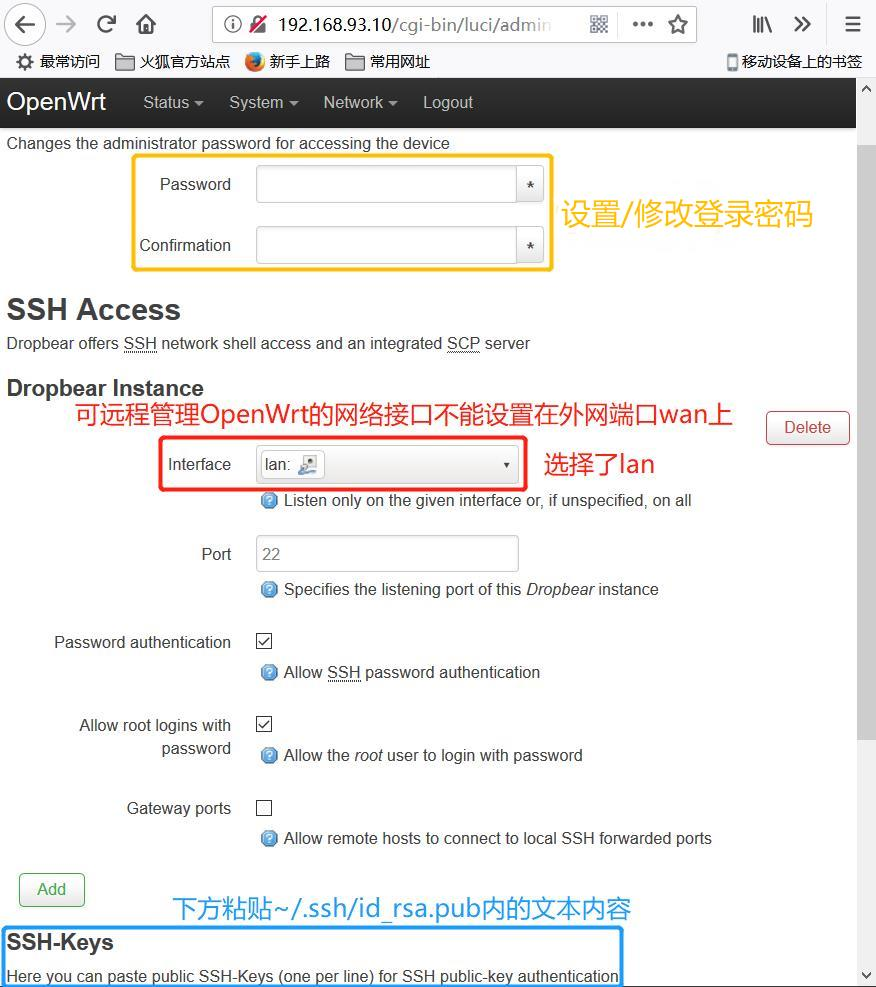
### 开启AP功能
- 插入无线网卡并分配到OpenWrt虚拟机上, 在OpenWrt虚拟机中执行:
  ```bash
  opkg update

  # 为使用lsusb命令
  opkg install usbutils

  lsusb
  # Bus 001 Device 002: ID 0846:9030 NetGear, Inc. WNA1100 Wireless-N 150 [Atheros AR9271]
  # 可以看到无线网卡的芯片名称为AR9271

  # 前往官网查看 AR9271 对应驱动为kmod-ath9k-htc
  opkg install kmod-ath9k-htc

  # 查看 USB 外设的驱动加载情况
  lsusb -t
  # /:  Bus 01.Port 1: Dev 1, Class=root_hub, Driver=ehci-pci/12p, 480M
  #  |__ Port 1: Dev 2, If 0, Class=Vendor Specific Class, Driver=ath9k_htc, 480M
  # 成功安装

  # 让 OpenWrt 支持 WPA 系列更安全的无线安全机制
  opkg install wpa-supplicant hostapd
  ```
- 通过`OpenWrt`的`LuCI`完成无线网络的配置, 手工指定监听信道和信号强度:<br>
  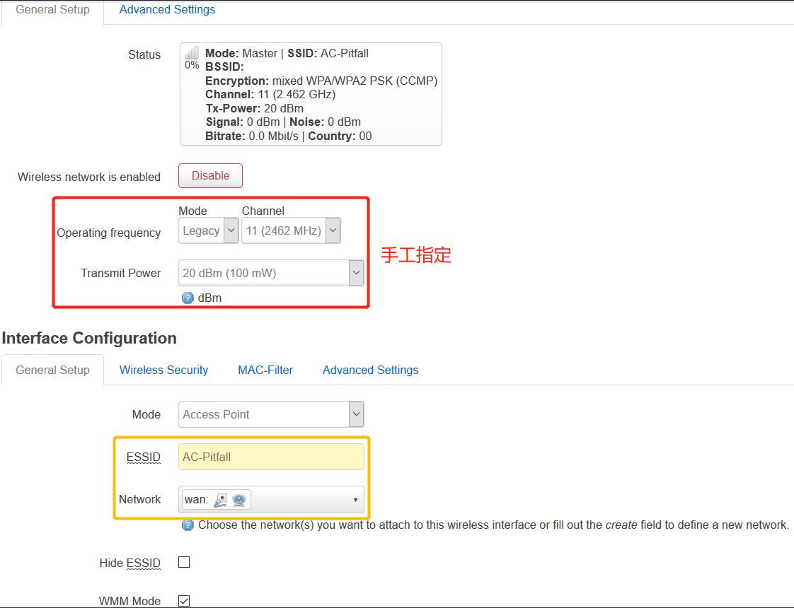<br>如果`Status`显示`Wireless is disabled`, 可以重启(先`Disable`再`Enable`)`Wireless network`
- `Wireless Security`选择加密方式为`WPA-PSK/WPA2-PSK Mixed Mode`
### 其他人接入网络
- 当没有用户接入时:<br>
  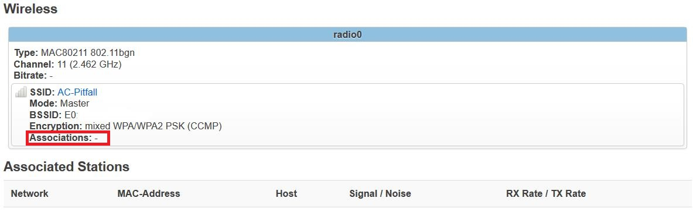
- 有用户接入时:<br>
  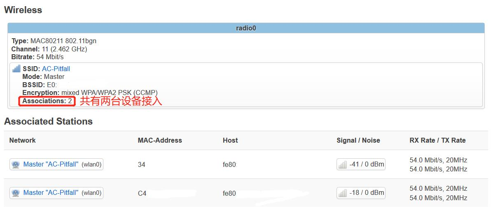
### AP配置
- [x] 重置和恢复AP到出厂默认设置状态
  ```bash
  firstboot && reboot now
  ```
- [ ] 设置AP的管理员用户名和密码
  - [ ] 设置AP管理员的用户名
  - [x] 设置AP管理员的密码
    - 可以通过`passwd`在虚拟机内设置, 也可以使用`luCI`:<br>
      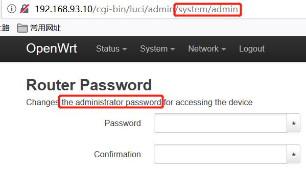
- [x] 配置不同的加密方式
  - 在`Interface Configuration`下的`Wireless Security`中修改加密方式:<br>
    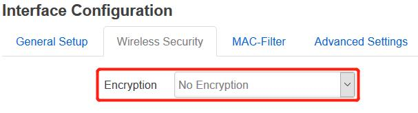
## 其它问题
### 使用`opkg update`时遇到`wget returned 4`错误
- `opkg_download: Check your network settings and connectivity.`查看网络连接正常, `ping baidu.com`也可`ping`通, 多次尝试`opkg update`仍然失败。
- 解决办法: 先使用`wget`下载`opkg update`安装失败的安装包
### 新添加的Host-Only网卡无法使用
- 在[ns-0x01](https://github.com/CUCCS/2019-NS-Public-YanhuiJessica/tree/ns0x01/ns-0x01#gateway-debian)中提到通过使用管理员权限重新安装虚拟机来解决Host-Only网卡无法使用的问题, 显然这个方法不够优秀
- 查看宿主机网络连接, 找到该Host-Only网卡, 对比可以正常使用的Host-Only网卡并无明显差异, 禁用再重新启用, 虚拟机即可正常启动。
### 关闭USB口电量限制
- `设备管理器 -> 通用串行总线控制器 -> USB根集线器(USB 3.0) -> 电源管理`
## 实验总结
- 要在虚拟机中的`OpenWrt`开启无线网络支持或使用无线网络，需要借助无线网卡硬件设备
## 参考资料
- [SOLVED: Failed to download the package list Archer C7 v2 with LEDE 17.01.0](https://forum.openwrt.org/t/solved-failed-to-download-the-package-list-archer-c7-v2-with-lede-17-01-0/2557/5)
- [OpenWrt on VirtualBox HowTo](https://openwrt.org/docs/guide-user/virtualization/virtualbox-vm)
- [dd(1) - Linux man page](https://linux.die.net/man/1/dd)
- [Failsafe Mode, Factory Reset, and Recovery Mode](https://openwrt.org/docs/guide-user/troubleshooting/failsafe_and_factory_reset)