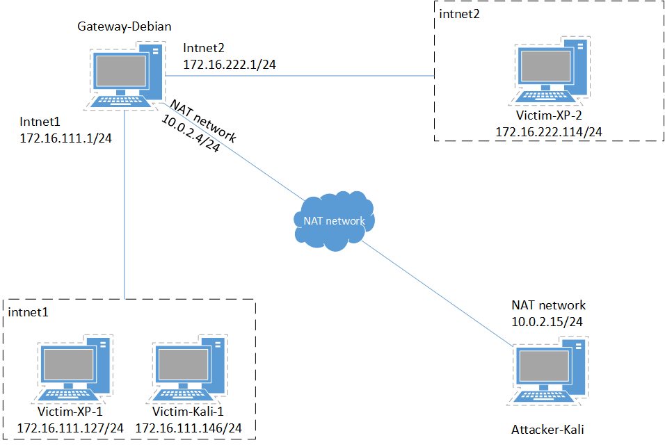
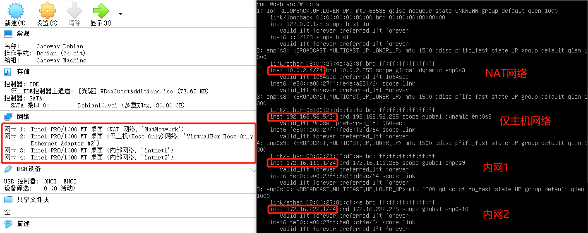
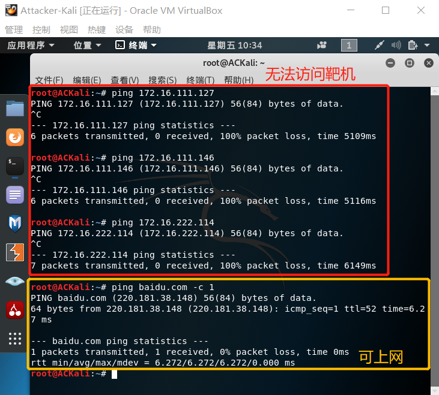

# 基于 VirtualBox 的网络攻防基础环境搭建
## 实验要求
- [x] [虚拟硬盘配置成多重加载](#虚拟硬盘多重加载)
- [x] 网络拓扑图与搭建
- [x] 网络连通性测试(除Victim-Kali-1)
  - [x] 靶机可以**直接**访问攻击者主机
    - 靶机与攻击者主机不在同一个网段, 访问显然需要通过网关
  - [x] 攻击者主机无法**直接**访问靶机
  - [x] [网关可以**直接**访问攻击者主机和靶机](#网关可以直接访问攻击者主机和靶机)
  - [x] 靶机的所有对外上下行流量必须经过网关
  - [x] 所有节点均可以访问互联网
## 实验过程
### 虚拟硬盘多重加载
- 需要先将下载的vdi(普通)文件与本地虚拟机关联,否则会在修改时出现以下报错信息:<br>
  
- 管理 -> 虚拟介质管理, 选中需要修改的虚拟硬盘, 修改类型为"多重加载"并应用, 将会先从原来关联的虚拟电脑中释放, 修改成功后再与原来关联的虚拟机建立联系:<br>
  
  可以看到虚拟硬盘类型显示为"多重加载":<br>
  
  
- 可以将一个多重加载类型的虚拟硬盘用于多个虚拟机上, 免去了每次新建的虚拟机都要安装操作系统的烦恼
  - 有一个安装了增强功能的虚拟机, 新建一个与之共用一个多重加载虚拟硬盘的虚拟机, 增强功能并不会沿用到新的虚拟机上
### 网络拓扑
- 网络节点: 攻击者主机、网关、靶机
  
### 为内网模式虚拟机分配IP地址
- 刚开始看到内网模式的WinXP虚拟机有IPv4地址而且和Debian网关(除了基本网卡其他都没有配置)可以互通, 就以为内网模式的Kali也应该有, 然而没有:<br>
  
  以为是~~内网模式Kali的网卡配置问题或者是因为其他原因IPv4地址无法显示~~, 实际上内网模式需要手动将**虚拟网卡配置为使用静态IP地址**, 或者使用DHCP服务器(可以使用Debian的dnsmasq, 参考[官方文档](https://wiki.debian.org/dnsmasq#Basic_DHCP_Setup)的操作没有成功, 仅收到了DHCP REQUEST的广播包, 并没有发出DHCP OFFER)来分配IP地址
### 各虚拟机网络配置
#### 靶机
##### Victim-XP-1

##### Victim-Kali-1

##### Victim-XP-2

#### 攻击者主机
##### Attacker-Kali
- 需要注意的是网卡设置为NAT网络后, 如: 网络CIDR是10.0.2.0/24, 那么将默认设置10.0.2.1为网关。但是攻击者主机只需要与网关互通, 无需访问靶机, 只需要保证与网关的一个端口在同一个网段中, 所以无需修改默认网关。

#### 网关
##### Gateway-Debian

### 配置端口转发
- 重启Debian后查看iptables发现内网2的靶机竟然已经自动加入了！查看该靶机发现所有网络配置都是自动获得的, 但是内网1的靶机却不能做到。 查看/etc/network/interfaces配置文件发现两者的规则是不同的:<br>
  <br>
- 可以直接为内网1的靶机配置DNS服务器为常用DNS服务器, 如114.114.114.114。由于与内网1不在一个网段, 实际上还是需要经过网关
- 使用iptables设置端口转发
  ```
  iptables -t nat -L #选择NAT表并列出所有规则
  iptables-save -c > iptables.rules #将规则写入iptables.rules
  vi iptables.rules #编辑
  #依照已有的内网2的设置添加内网1的设置
  iptables-restore < iptables.rules #将规则写回iptables
  ```
- iptables.rules配置如下:<br>
  
### 连通性测试
#### Victim-XP-1

#### Victim-Kali-1
- 暂未实现
#### Victim-XP-2

#### Attacker-Kali

#### Gateway-Debian
- 
- 
## 其它问题
### 使用新添加的Host-Only网卡无法启动虚拟机

- 解决方法: 以管理员身份重新安装Oracle VM VirtualBox
### Debian: 'arp: command not found'
尝试使用apt-get安装arp包, 发现不能定位包, update之后也没有用, 使用whereis可以找到arp.7.gz。
- 解决方法: 安装net-tools包, 包里包含arp、ifconfig等命令
### Debian: Host-Only网络
- 为虚拟机添加Host-Only网络的网卡后, 在虚拟机内查看该网卡对应的IP地址, 不在网卡DHCP服务器对应的网段中, 导致无法使用ssh连接虚拟机
- 解决方法: 修改虚拟机该网卡对应的IP地址使其属于有效网段(永久修改需要修改配置文件), 或修改DHCP服务器对应的网段
## 实验总结
### 各个模式的区别
Mode|VM->Host|VM<-Host|VM1<->VM2|VM->Net/LAN|VM<-Net/LAN
-|-|-|-|-|-
Host-Only|+|+|+|-|-
Internal|-|-|+|-|-
NAT|+|Port forward|**-**|+|Port forward
NAT service|+|Port forward|+|+|Port forward
## 参考资料
- [基于VirtualBox的网络攻防基础环境搭建 - 林淑琪](https://github.com/CUCCS/2018-NS-Public-jckling/blob/master/ns-0x01/%E5%9F%BA%E4%BA%8EVirtualBox%E7%9A%84%E7%BD%91%E7%BB%9C%E6%94%BB%E9%98%B2%E5%9F%BA%E7%A1%80%E7%8E%AF%E5%A2%83%E6%90%AD%E5%BB%BA.md)
- [Windows 10 - Host Only Adapters](https://forums.virtualbox.org/viewtopic.php?f=6&t=94277)
- [Chapter 6. Virtual networking](https://www.virtualbox.org/manual/ch06.html#network_nat)
- [-bash: netstat: command not found - Debian/Ubuntu Linux](https://linuxconfig.org/bash-netstat-command-not-found-debian-ubuntu-linux)
- [Example: Connect a private subnet to the internet using NAT](https://www.karlrupp.net/en/computer/nat_tutorial)