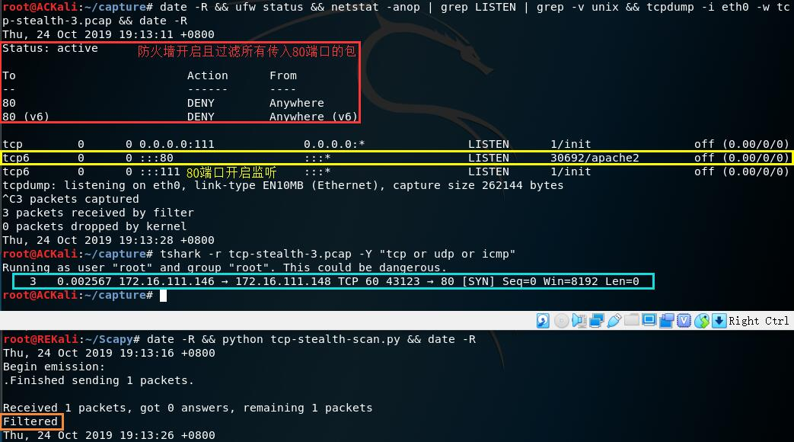
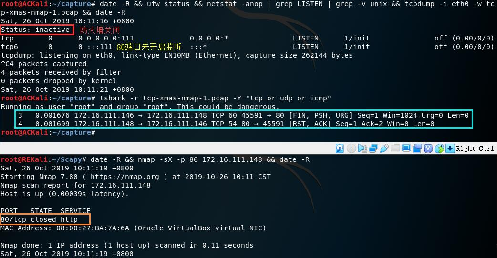

# 基于 Scapy 编写端口扫描器
## 实验要求
- [x] 完成以下扫描技术的编程实现
  - [x] [`TCP connect scan`](#tcp-connect-scan) / [`TCP stealth scan`](#tcp-stealthsyn-scan)
  - [x] [`TCP Xmas scan`](#tcp-xmas-scan) / [`TCP FIN scan`](#tcp-fin-scan) / [`TCP NULL scan`](#tcp-null-scan)
  - [x] [`UDP scan`](#udp-scan)
## 实验过程
### 网络拓扑

### 端口状态的模拟
- 关闭状态<br>
对应端口没有开启监听, 防火墙没有开启
- 开启状态<br>
  - 对应端口开启监听: `apache2`基于`TCP`, 在`80`端口提供服务, 开启`80`端口监听可以使用`service apache2 start`, `DNS`服务基于`UDP`,在`53`端口提供服务, 开启`53`端口监听可以使用`service dnsmasq start`。<br>
  - 防火墙处于关闭状态
- 过滤状态<br>
对应端口开启监听, 防火墙开启
- 本次实验中防火墙的开启与关闭使用的是`ufw`，操作较为简单。当然，直接使用`iptables`也是可以的
### `TCP connect scan`
- 代码
    ```py
    #! /usr/bin/python

    import logging
    logging.getLogger("scapy.runtime").setLevel(logging.ERROR)
    # Used before importing the Scapy module inside the Python program
    # Sets logging only for errors that occur during the program execution and not the warnings.
    from scapy.all import *

    dst_ip = "172.16.111.148"   # ACKAli
    src_port = RandShort()  # 生成一个随机数
    st_port = 80

    tcp_connect_scan_resp = sr1(IP(dst=dst_ip)/TCP(sport=src_port,dport=dst_port,flags="S"),timeout=10)
    if tcp_connect_scan_resp is None:
    # if(str(type(tcp_connect_scan_resp))=="<type 'NoneType'>"):  #端口没有响应
        print "Filtered"
    elif(tcp_connect_scan_resp.haslayer(TCP)):
        if(tcp_connect_scan_resp.getlayer(TCP).flags == 0x12):  #Flags: 0x012 (SYN, ACK)
            send_rst = sr(IP(dst=dst_ip)/TCP(sport=src_port,dport=dst_port,flags="AR"),timeout=10)
            print "Open"
        elif (tcp_connect_scan_resp.getlayer(TCP).flags == 0x14):   #Flags: 0x014 (RST, ACK)
            print "Closed"
    ```
- 端口关闭状态<br>
  
- 端口开放状态<br>
  
- 端口过滤状态<br>
  
### `TCP stealth/SYN scan`
- 并不打开一个完整的链接, 当得到的是一个`SYN/ACK`包时通过发送一个`RST`包立即拆除连接。
- 代码
    ```py
    #! /usr/bin/python

    import logging
    logging.getLogger("scapy.runtime").setLevel(logging.ERROR)
    from scapy.all import *

    dst_ip = "172.16.111.148"   # ACKAli
    src_port = RandShort()
    dst_port = 80

    stealth_scan_resp = sr1(IP(dst=dst_ip)/TCP(sport=src_port,dport=dst_port,flags="S"),timeout=10)
    if stealth_scan_resp is None:
        print "Filtered"
    elif(stealth_scan_resp.haslayer(TCP)):
        if(stealth_scan_resp.getlayer(TCP).flags == 0x12):
            send_rst = sr(IP(dst=dst_ip)/TCP(sport=src_port,dport=dst_port,flags="R"),timeout=10)   #拆除链接
            print "Open"
        elif (stealth_scan_resp.getlayer(TCP).flags == 0x14):
            print "Closed"
    ```
- 端口关闭状态<br>
  
- 端口开启状态<br>
  
- 端口过滤状态<br>
  
### `TCP Xmas scan`
- 代码
    ```py
    #! /usr/bin/python

    import logging
    logging.getLogger("scapy.runtime").setLevel(logging.ERROR)
    from scapy.all import *

    dst_ip = "172.16.111.148"   # ACKAli
    src_port = RandShort()
    dst_port = 80

    xmas_scan_resp = sr1(IP(dst=dst_ip)/TCP(dport=dst_port,flags="FPU"),timeout=10) # FIN, PUSH, URG
    if xmas_scan_resp is None:
        print "Open|Filtered"
    elif(xmas_scan_resp.haslayer(TCP)):
        if(xmas_scan_resp.getlayer(TCP).flags == 0x14):
            print "Closed"
    ```
- 端口关闭状态<br>
  
- 端口开启状态<br>
  
- 端口过滤状态<br>
  
### `TCP FIN scan`
- 代码
    ```py
    #! /usr/bin/python

    import logging
    logging.getLogger("scapy.runtime").setLevel(logging.ERROR)
    from scapy.all import *

    dst_ip = "172.16.111.148"   # ACKAli
    src_port = RandShort()
    dst_port = 80

    fin_scan_resp = sr1(IP(dst=dst_ip)/TCP(dport=dst_port,flags="F"),timeout=10)
    if fin_scan_resp is None:
        print "Open|Filtered"
    elif(fin_scan_resp.haslayer(TCP)):
        if(fin_scan_resp.getlayer(TCP).flags == 0x14):
            print "Closed"
    ```
- 端口关闭状态<br>
  
- 端口开启状态<br>
  
- 端口过滤状态<br>
  
### `TCP NULL scan`
- 代码
    ```py
    #! /usr/bin/python

    import logging
    logging.getLogger("scapy.runtime").setLevel(logging.ERROR)
    from scapy.all import *

    dst_ip = "172.16.111.148"   # ACKAli
    src_port = RandShort()
    dst_port = 80

    null_scan_resp = sr1(IP(dst=dst_ip)/TCP(dport=dst_port,flags=""),timeout=10)
    if null_scan_resp is None:
        print "Open|Filtered"
    elif(null_scan_resp.haslayer(TCP)):
        if(null_scan_resp.getlayer(TCP).flags == 0x14):
            print "Closed"
    ```
- 端口关闭状态<br>
  
- 端口开启状态<br>
  
- 端口过滤状态<br>
  
### `UDP scan`
- `DNS`运行在`53`端口并且使用`UDP`
- 代码
    ```py
    #! /usr/bin/python

    import logging
    logging.getLogger("scapy.runtime").setLevel(logging.ERROR)
    from scapy.all import *

    dst_ip = "172.16.111.148"   # ACKAli
    src_port = RandShort()
    dst_port = 53
    dst_timeout = 10

    def udp_scan(dst_ip,dst_port,dst_timeout):
        udp_scan_resp = sr1(IP(dst=dst_ip)/UDP(dport=dst_port),timeout=dst_timeout)
        if udp_scan_resp is None:
            return "Open|Filtered"
        elif(udp_scan_resp.haslayer(ICMP)):
            if(int(udp_scan_resp.getlayer(ICMP).type)==3 and int(udp_scan_resp.getlayer(ICMP).code)==3):
            # ICMP Type: 3 (Destination unreachable)
            # ICMP Code: 3 (Port unreachable)
                return "Closed"

    print(udp_scan(dst_ip,dst_port,dst_timeout))
    ```
- 端口关闭状态<br>
  
- 端口开启状态<br>
  - 网关开启提供`DNS`服务
    - 判断开启状态需要发送`DNS`询问包
      ```py
      # 参照nmap发送的包构造
      udp_scan_resp = sr1(IP(dst=dst_ip)/UDP(dport=dst_port)/DNS(opcode=2),timeout=dst_timeout)
      # rd = truncated

      # 添加判断
      elif (udp_scan_resp.haslayer(UDP)):
        return "Open"
      ```
      
    - 最后一个`ICMP Destination unreachable`出现的原因: `REKali`的`53`端口未开启监听
  - 网关未开启<br>
    
- 端口过滤状态<br>
  
### 使用`nmap`进行扫描
#### `TCP connect scan`
- `nmap -sT -p 80 172.16.111.148`
- 端口关闭状态<br>
  
- 端口开启状态<br>
  
- 端口过滤状态<br>
  
#### `TCP stealth scan`
- `nmap -sS -p 80 172.16.111.148`
- 端口关闭状态<br>
  
- 端口开启状态<br>
  
- 端口过滤状态<br>
  
#### `TCP Xmas scan`
- `nmap -sX -p 80 172.16.111.148`
- 端口关闭状态<br>
  
- 端口开启状态<br>
  
- 端口过滤状态<br>
  
#### `TCP FIN scan`
- `nmap -sF -p 80 172.16.111.148`
- 端口关闭状态<br>
  
- 端口开启状态<br>
  
- 端口过滤状态<br>
  
#### `TCP NULL scan`
- `nmap -sN -p 80 172.16.111.148`
- 端口关闭状态<br>
  
- 端口开启状态<br>
  
- 端口过滤状态<br>
  
#### `UDP scan`
- `nmap -sU -p 53 172.16.111.148`
- 端口关闭状态<br>
  
- 端口开启状态<br>
  - 网关开启提供`DNS`服务<br>
    
  - 网关未开启<br>
    
- 端口过滤状态<br>
  
## 其它问题
### `tcp6`
- 在查看监听时总能看到`tcp6 0 0 :::53 :::* LISTEN`, 那么`tcp6`是什么？
  > The protocol used. Here it is TCP over IPv6
- 那么, 问题来了, 为什么`apache2`运行时, 只有`tcp6`而没有`IPv4`的`tcp`呢？这是由于当`V6ONLY`未启用时, `IPv6 socket`也可以处理`IPv4`, 于是就只监听`IPv6`了。
  > An IPv6 socket might be able to receive IPv4 packets if V6ONLY is not enabled
- 可以通过修改`/etc/apache2/ports.conf`让其只监听`tcp`:<br>
  ```bash
  # Origin: Listen 80
  Listen 0.0.0.0:80
  ```

## 实验总结
- 每一次扫描测试的抓包结果与课本中的扫描方法原理基本相符
- ```
  TSval: Timestamp value
  TSecr: Timestamp echo reply
  ```
### `Scapy`
- `TCP`中的`flags`参数值填写需要置`1`字段名的首字母(顺序任意), 如`[RST, ACK]`对应`AR`, 也可以填写对应的字段值, 如`flags=0x2`:<br>
  
- ```py
  sr()
  #for sending packets and receiving answers
  #returns a couple of packet and answers, and the unanswered packets

  sr1()
  #only returns one packet that answered the packet (or the packet set) sent
  ```
### `Kali`防火墙`ufw`的使用
```bash
ufw enable  #开启防火墙
ufw disable #关闭防火墙

#ufw deny <port>/<optional: protocol>
ufw deny 80 #过滤80端口上所有包
ufw deny 80/tcp #过滤传入80端口的TCP包

ufw status  #查看当前防火墙的状态和现有规则
```
## 参考资料
- [2018-NS-Public-jckling/ns-0x05](https://github.com/CUCCS/2018-NS-Public-jckling/blob/master/ns-0x05/5.md)
- [Usage — Scapy 3 documentation](https://scapy.readthedocs.io/en/latest/usage.html)
- [Port Scanning using Scapy](https://resources.infosecinstitute.com/port-scanning-using-scapy/)
- [UFW](https://help.ubuntu.com/community/UFW)
- [Port Scanning Techniques](https://nmap.org/book/man-port-scanning-techniques.html)
- [Why is my computer trying to send ICMP type 3 to OpenDNS?](https://unix.stackexchange.com/questions/94187/why-is-my-computer-trying-to-send-icmp-type-3-to-opendns)
- [为什么 netstat 对某些服务只显示了 tcp6 监听端口](https://www.chengweiyang.cn/2017/03/05/why-netstat-not-showup-tcp4-socket/)