# Web 应用漏洞攻防

## 实验要求
- [x] 每个实验环境完成不少于 5 种不同漏洞类型的漏洞利用练习
- [x] 使用不同于官方教程中的漏洞利用方法完成目标漏洞利用练习
- [x] 最大化漏洞利用效果实验
- [x] ~~编写自动化漏洞利用脚本~~使用`BurpSuite`自动化工具完成指定的训练项目
- [x] 定位缺陷代码
- [x] 尝试从源代码层面修复漏洞

## WebGoat 7.1

### 命令注入

#### Command Injection

- 通过命令注入扩展程序的默认功能
- `Windows`下命令连接
  ```bash
  & # 连接的命令按序连续读取, 正确命令执行, 错误命令跳过
  && # 连接的命令按序连续读取, 正确命令执行, 遇到错误命令则终止后续的命令读取
  || # 连接的命令按序连续读取, 执行第一个正确命令并跳出
  ```
- `Linux`下命令连接
  ```bash
  ; # 连接的命令按序连续读取, 正确命令执行, 错误命令跳过
  && # 连接的命令按序连续读取, 正确命令执行, 遇到错误命令则终止后续的命令读取
  || # 连接的命令按序连续读取, 执行第一个正确命令并跳出
  ```
- 本题使用`&`或`;`或`&&`连接一个命令即可, 但只能使用`netstat -a`/`dir`/`ls`/`ifconfig`/`ipconfig`
- 注意引号的闭合

#### 修复方法

- 通过转义或禁止命令连接符的方式

### 未验证用户的输入

#### Bypass HTML Field Restrictions

- 使用开发者工具查看`Disabled input field:`的表单变量名`name="disabledinput"`
- 使用BurpSuite拦截POST请求, 修改所有表单项的表单数据后发送即可通关
- 使用`Firefox`的开发者工具对POST包进行编辑和重发并不能成功
  - 准备发送的请求: <br>
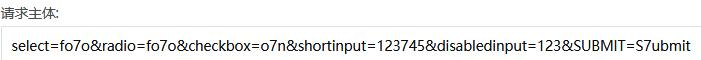
  - 使用BurpSuite拦截发现请求信息被截断: <br>
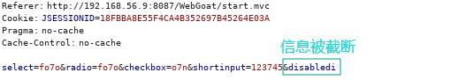
  - 通过观察发现POST包中有一个参数, 用来指明发送给接收方的消息主体的大小, 用十进制数字表示的八位字节的数目: <br>

  - 由于内容长度没有变, 而消息长度变化了, 所以消息会被截断, 使用`BurpSuite`能够成功的原因就是不需要用户修改这一个字段。一个ASCII字符占一个字节, 被截断后剩余的表单字符串长度为63字节, 原`Content-Length`也是63字节, 因此需要`Content-Length`修改为86, `Firefox`成功！

#### Bypass Client Side JavaScript Validation

- 对于绕过前端校验除了可以通过修改拦截的POST包以外, 还可以删除进行校验的`JavaScript`

### 缓冲区溢出

#### Off-by-One Overflows

- 这道题的题目设计有点令人震惊, 课程的源代码里直接是`if(param3.length() > 4096)`(param3是其中一个输入参数), 只要长度够了就可以获得答案。~~原来这就是缓冲区溢出漏洞啊！~~
- 第一步, 随意输入字符串:<br>
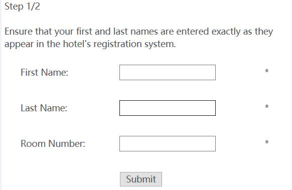
- 第二步, 提交并使用`BurpSuite`拦截, 将拦截的消息发送至`Intruder`。在`Positions`选项卡, 攻击类型选择`Sniper`, 参数只标记`room_no`对应源码中的`param3`
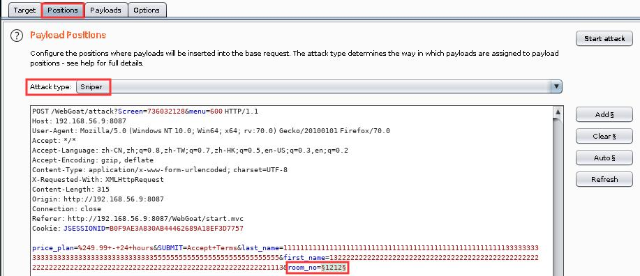
  - > Sniper: single payload set, only one value is replaced for all the payload positions in sequence
- 在`Payloads`选项卡, 使用任意字符进行填充, 保证最后`room_no`字符串长度大于4096即可, 最后点击`Start attack`, 在`Response`中获得答案<br>
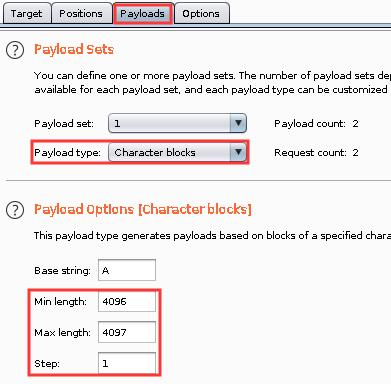

#### 漏洞分析及修复方法

- 缓冲区溢出常与`C/C++`相关, 他们不自动检查输入数组的数据是否在数组边界内, 特别是`strcpy`等函数, 超出数组范围的数据将强制覆盖正常的数据并导致运行时错误。黑客还可以通过缓冲区溢出来强制用户执行指定位置的程序。<br>
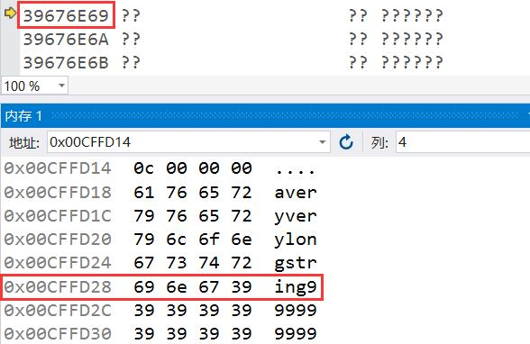
- 可以进行边界检查, 但需要额外的代码和处理时间。现代操作系统常用随机化内存布局的方式(这样每次运行时, 函数在内存的位置都无法确定)来抵抗缓冲区溢出攻击, 或者在缓冲区之间留出空间并寻找写入这些区域的操作

### XXE

#### 前置知识

- DTD(DTD Document Type Definition, 文档类型定义), 可定义合法的XML文档构建模块。
  ```html
  <!-- 内部 DOCTYPE 声明 -->
  <!DOCTYPE 根元素 [元素声明]>
  <!-- 内部实体声明 -->
  <!ENTITY 实体名称 "实体的值">

  <!-- 一个实例(定义+使用) Start -->
  <?xml version="1.0"?>

  <!DOCTYPE AC [
    <!ENTITY problem_num "ns0x07">

    <!-- Accessing a local resource -->
    <!ENTITY passwd SYSTEM "file:///etc/passwd">
  ]>

  <problem>&problem_num;</problem>
  <!-- 一个实例 End-->
  ```

#### XML External Entity (XXE)

- 本题需要通过`XXE`来展示根目录
- 首先通过输入可以发现程序会将输入字符串展示在页面上(根据源代码的检查机制, 似乎无法使用跨站脚本攻击): <br>
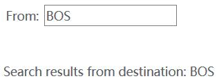
- 使用`BurpSuite`拦截, 发现`POST`中的参数是`<?xml version="1.0"?><searchForm>  <from>BOS</from></searchForm>`
- 修改为`<?xml version="1.0"?><!DOCTYPE AC [<!ENTITY root SYSTEM "file:///">]><searchForm><from>&root;</from></searchForm>`并发送

### 脆弱的访问控制 - Session Management Flaws

#### Spoof an Authentication Cookie

- 浏览器通过`Cookie`来标识用户身份, 未设置`HttpOnly`的网页或不支持`HttpOnly`的浏览器可以通过前端脚本访问和修改`Cookie`从而绕过登录
- 本题先分别登录`webgoat`和`aspect`两个账户, 可以看到都有一个`AuthCookie`字段, 是用来区分身份的`Cookie`
  User|AuthCookie
  -|-
  webgoat|65432ubphcfx
  aspect|65432udfqtb
- 通过观察发现: 前五个数字字段是相同的, 后面的英文长度与用户名长度相对应, 根据用户名中相同的英文字母推断, 可以得出生成规则: 将用户名字符串翻转, 所有字母替换为原字母在字母表上后移一位后所得的字母。因此`alice`对应的`AuthCookie`为`65432fdjmb`
- 退出登录, 在 开发者工具 -> 控制台 输入`document.cookie="AuthCookie=65432fdjmb"`, 点击`Login`即可成功登录`alice`帐号

#### Hijack a Session

- 本题标记身份的是`WEAKID`, 如果`POST`中不包含`WEAKID`, 服务器会在`Response`中给出。当然服务器不会分配已经在使用的`WEAKID`
- 使用`BurpSuite`拦截一个`POST`请求, 并删除所有的`WEAKID`字段, 发送给`Sequencer`(发包并查看服务器返回的`WEAKID`): <br>
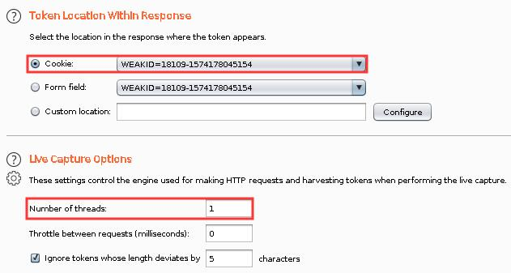
- `Start live capture`后保持一段时间再`Stop`, `Copy tokens`到`Manual load`粘贴, `-`的前后数字都是递增的, 前者是序列号, 后者是`Unix`时间戳, 会发现等差数列中缺少了一个`18125`, 推测是已经在使用的`WEAKID`: <br>
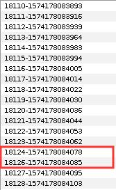
- 使用`BurpSuite Intruder`中的`Sniper`对后面的时间戳进行枚举, 从`1574178084079`到`1574178084084`。在返回信息中, 有一个长度与其他的明显不同, 由此可以确认正在使用的完整的`WEAKID`是`18125-1574178084081`: <br>
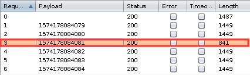

#### Session Fixation

- 将攻击者的`SID`附在链接后面, 受害者点击链接后登录会携带该`SID`: <br>
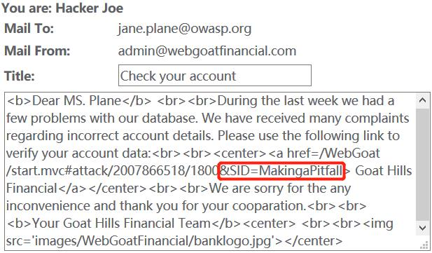
- 受害者点击邮件链接并正常登录, `POST`请求携带有攻击者提供的`SID`: <br>
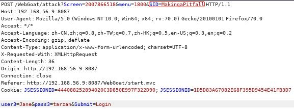
- 攻击者登录, 修改`POST`中的`SID`为受害者当前的`SID`, 即可成功登录

#### 修复方法

- 设置`HttpOnly`, 禁止客户端访问`Cookie`
- 对抗会话固定攻击, 可在每次登录后都重置会话ID, 避免攻击者用自己的会话ID劫持会话

### SQL 注入

#### Numeric SQL Injection

- 在原`POST`请求中添加` or true`即可
- 通过之后, 课程变为参数化查询, 输入数据是参数而不是SQL语句的一部分, 不能再进行SQL注入攻击
- 不过既然返回结果, 可以显示在界面上, 那么可以试试能否使用`XSS`攻击: <br>
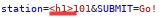<br>
  页面成功渲染！<br>
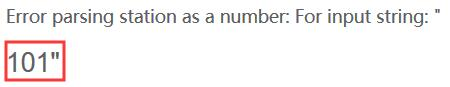
- 然后愉快地弹框: <br>
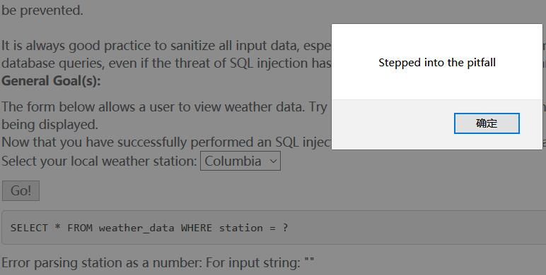

#### String SQL Injection

- 与`Numeric SQL Injection`是类似的, 只是多了引号, `Smith' or true --`/`Smith' or '1'='1`即可(有很多方法来匹配引号)

## Juice Shop

### Finding Score Board

- 使用开发者工具在网页的`js`代码中查找`score`即可找到对应的网页链接(也可以直接猜)

### XSS

#### DOM XSS

- 搜索结果可以被展示在页面上
- 可通过可显示的普通标签, 如`<h1>`, 进行检测
- 直接在搜索栏输入`<iframe src="javascript:alert('xss')">`并回车即可完成弹框(``也可以)

### Injection

#### Login Admin

- 尝试在用户名中输入`' or true`, 可以看到返回的错误信息, 其中就包含出错的SQL语句, 出错是因为引号没有闭合: <br>
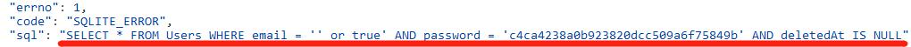
- 可以通过`--`来把后面的语句全部注释, 这样实际执行的就只剩下`SELECT * FROM Users WHERE email = '' or true`
- 此题使用`' or '1'='1`服务器会返回`Invalid email or password.`, 但使用`' or '1'='1' --`则可以成功登录
  - 将引号移至1后: `' or '1'=1'`则返回`SQLITE_ERROR`, 猜测是服务器会对引号匹配进行检查

### Broken Anti Automation

#### CAPTCHA Bypass

- 刷新前端时, 发现`CAPTCHA`确实一直在变。
- 使用`BurpSuite`拦截`POST`请求, 发现`CAPTCHA`并不是即时生成的, 而是已经存在的, 并有对应的`ID`: <br>
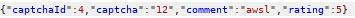
- 那么接下来就很简单了, 使用`Intruder`发十个重复包即可, `Attack type: Sniper/Payload type: Null payloads`

### Improper Input Validation

#### Zero Stars

- 评价发送后使用`BurpSuite`拦截, 修改`rating`为0再发送给服务器

## 实验总结

- `BurpSuite`自动化工具真好用！
- 前端校验仅增加用户体验, 并没有实际意义(全都可以绕过~★)
- 仔细观察前端代码和`GET`/`POST`请求, 会有小惊喜！

## 参考资料
- [Command Injection](https://www.owasp.org/index.php/Command_Injection)
- [Burp Suite Tutorial: Part 2 – Intruder and repeater tools](https://computerweekly.com/tutorial/Burp-Suite-Tutorial-Part-2-Intruder-and-repeater-tools)
- [Buffer overflow](https://en.wikipedia.org/wiki/Buffer_overflow)
- [HttpOnly](https://www.owasp.org/index.php/HttpOnly)