# 常见蜜罐体验和探索

## 实验要求

- [x] 记录蜜罐的详细搭建过程
- [x] 使用`nmap`扫描搭建好的蜜罐并分析扫描结果，同时分析「`nmap`扫描期间」蜜罐上记录得到的信息
- [x] 如何辨别当前目标是一个「蜜罐」？以自己搭建的蜜罐为例进行说明
- [x] 总结常见的蜜罐识别和检测方法

## 实验过程

### 网络拓扑

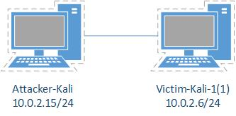

### 低交互蜜罐 - twisted-honeypots

#### 蜜罐搭建

- 安装`twisted-honeypots`
  ```bash
  pip3 install service_identity # dependency
  git clone https://github.com/lanjelot/twisted-honeypots /opt/twisted-honeypots
  cd /opt/twisted-honeypots
  sudo ./install.sh && services mysql start && ./setup-db.sh
  ```
- 由于`twisted-honeypots`是基于`Python3`编写的，需要将`Kali`中默认`Python`版本切换为`Python3`，执行以下命令：
  ```bash
  update-alternatives --install /usr/bin/python python /usr/bin/python2 1
  update-alternatives --install /usr/bin/python python /usr/bin/python3 2
  # 最后的数字1，2代表优先级
  ```
  - 之后可以使用`update-alternatives --config python`进行自由切换
- 使用方法
  ```bash
  sudo ./start.sh
  sudo ./stop.sh
  ./monitor.sh  # To monitor the current execution
  ```

#### 蜜罐探索

- 先使用`ping`确认连通性，然后尝试`ssh`连接，并获得「开测暴击」一份：<br>

  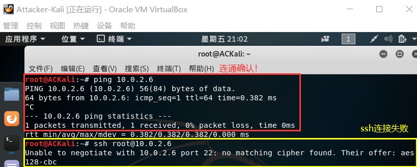
- 根据提示信息，尝试使用指定加密方式的方法来进行`ssh`连接：`ssh -c aes128-cbc root@10.0.2.6`，可以尝试连接了！（不过，只提供一种加密方式假的很明显）
  - 但是！似乎连接不上qwq...（看到能 SSH 很甜，连不上就不那么甜了，不过尝到甜头之后说不定会反复尝试XD）<br>
    - 有趣的是，在完整日志中，当特定的 用户名 + 密码 出现超过一定次数时，会多出一条信息：`Thank you X.X.X.X - usrname : passwd`

    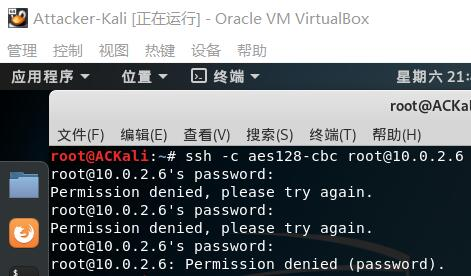
  - 靶机对于这些尝试连接均有记录，可通过这些记录避开设置一些被尝试过的用户名和密码（表格还统计了各IP地址、用户名、密码的出现次数）<br>

    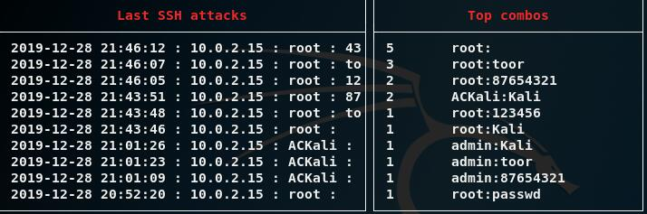
  - 连不上的问题似乎是出在这段日志：
    ```bash
    # /var/log/twistd-pot.log
    2019-12-28T21:46:02+0800 [sshpot.PotSSHFactory] disabling non-fixed-group key exchange algorithms because we cannot find moduli file
    ... ...
    2019-12-28T21:46:02+0800 [PotSSHServerTransport,2,10.0.2.15] NEW KEYS
    ```
  - `Twisted`还不太了解，但此蜜罐应该就只负责记录尝试进行连接的 Client 的 IP 地址、用户名及密码并标记尝试的时间
- 另外，`twisted-honeypots`对端口扫描情况也不会进行记录（只有记录连接的日志）：<br>

  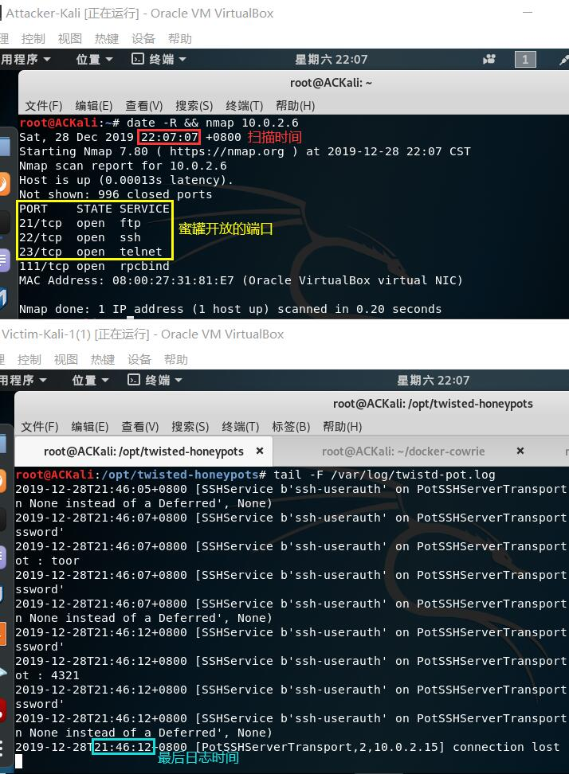
- 大部分 SSH 低交互蜜罐均为这种模式，只负责模拟并记录 Client 尝试进行登录的用户名和密码，而不模拟 Client 能登录的情况（~~零交互蜜罐~~）

### 中等交互蜜罐 - Cowrie

#### 蜜罐搭建

- 安装`Cowrie`
  ```bash
  apt update && apt install docker-compose  # 安装docker
  git clone https://github.com/cowrie/docker-cowrie.git
  pip3 install --upgrade pip  # 使 pip 命令可用，且为 python3 pip
  make all  # build all the images
  # make 可能会失败，需要多尝试几次
  ```
- 运行`Cowrie`：`docker-compose up -d`
- 在容器里执行命令使用`docker exec`
  ```bash
  # command in common use
  docker exec -it container_name command
  # -i: 保持 STDIN 打开
  # -t: 分配一个伪终端
  ```
- 日志记录在容器中，绝对路径：`/cowrie/cowrie-git/var/log/cowrie/cowrie.json`

#### 蜜罐探索

- 在`Attacker-Kali`上使用`nmap`扫描靶机（默认是`TCP SYN scan`），发现靶机无法获知端口被扫描情况：<br>

  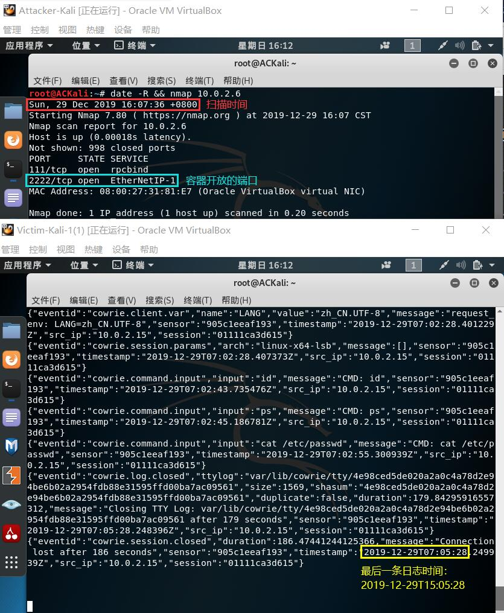
- `nmap`扫描中发现了开放的2222端口，如何知道应该尝试 SSH 连接？（~~靠脑洞和对蜜罐的无知XD~~）既不是常见的22端口（如要进行更改，参考 [Listening on port 22](https://cowrie.readthedocs.io/en/latest/INSTALL.html#step-7-listening-on-port-22-optional)），也不是 SSH 服务，能用 SSH 连上就已经可以断定这是蜜罐了
- 无知者开始进行 SSH 连接的用户名及密码的探索，并总结出如下规律
  - 只要使用`root`用户名，任何密码都可以成功登录
  - 使用除`root`以外的用户名，任何密码都无法登录
- 无论是否连接成功，所有的尝试都会被蜜罐记录：<br>

  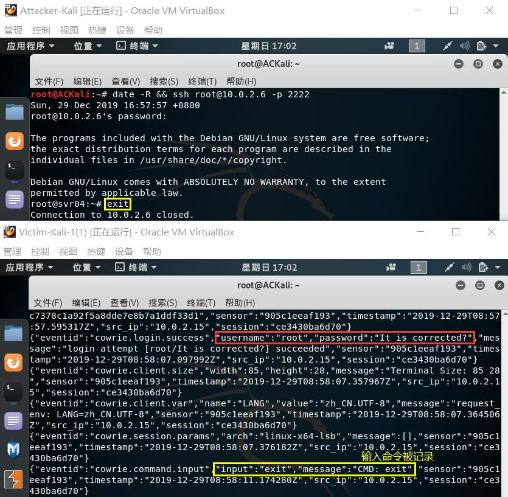 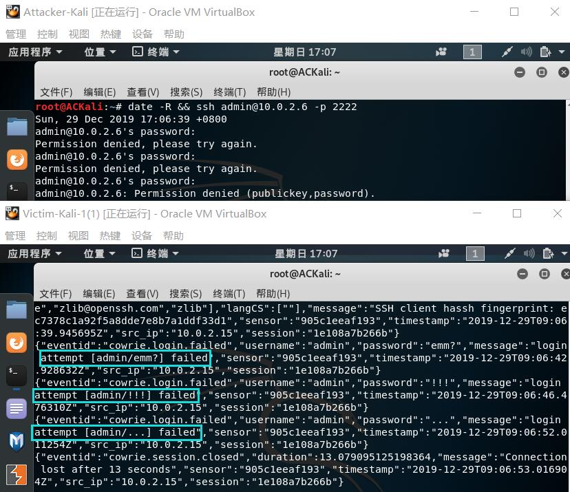
- 连接成功后，一段时间（时间很短，约三分钟）蜜罐会自动将连接断开：<br>
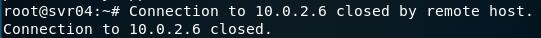
- 成功通过 SSH 连接进入~~蜜罐~~远程主机的无知者开始了新的探索
  - 探索 1：`ping`（破绽还是挺多的）<br>

    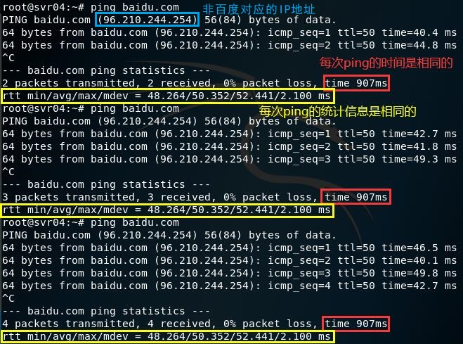 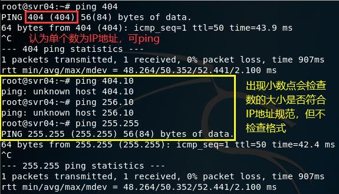
    - 多次尝试后可以推测蜜罐模拟「域名解析」的方式：对于一个新域名，在符合规范的情况下随机生成一个 IP 地址并记录；对于旧域名，调用先前的记录
    - 一些数在单个`ping`包的响应时间中反复出现，推测响应时间是从一个数组中随机选择的
  - 探索2：`curl`（这个倒像是那么一回事）
    - 从日志记录可以看到蜜罐会实实在在地 GET 网页数据（GET 得到的数据会保存，重复获取时可以直接使用，避免频繁的网络通信）<br>

      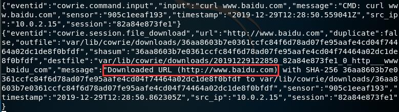
    - 返回速度相比于正常的`curl`要慢很多，因为系统分配给蜜罐的资源不会太多
    - 输入错误网址输出空白行，正常的`curl`会输出错误信息：`curl: (6) Could not resolve host: notexisted.com`<br>
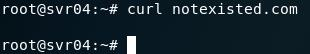
    - 可惜，随便加个选项就顶不住了（`-A`用于指定`User-Agent`）<br>
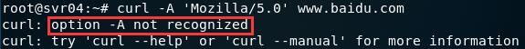
  - 探索3：可以使用`apt-get install`，但`apt-get`的其他常用命令均不可用<br>

    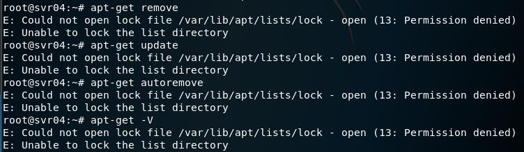

    - 即使是可以使用的`install`也破绽百出：<br>

      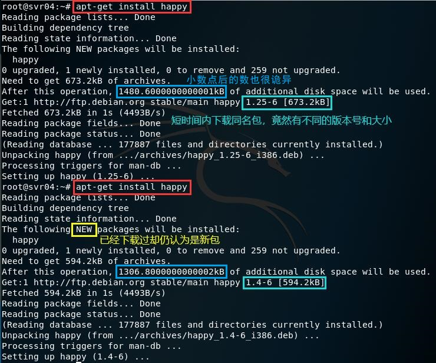
    - 不能使用`apt`代替`apt-get`，缺失的命令即使使用了`apt-get install`也不可以使用
  - 探索4：`wget`
    - 看到下面这张图我觉得可以不用继续了... ...（~~传说中的瞬间打脸~~）<br>
  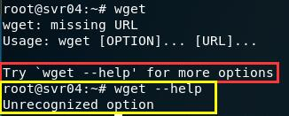
    - 不过还是可以看一下这个`wget`到底是怎么下载的。和`curl`一样，`wget`也会进行真正的下载：<br>

      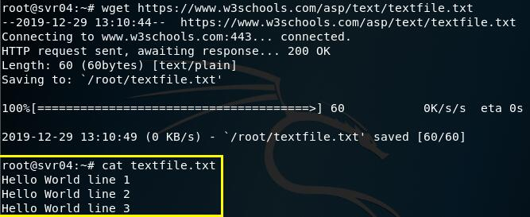

      - 刚下载下来可以用`ls`在当前目录看到，但退出再连接后就没有了，尽管容器里的文件并没有消失（家目录下没有别的文件也挺奇怪的）：<br>

        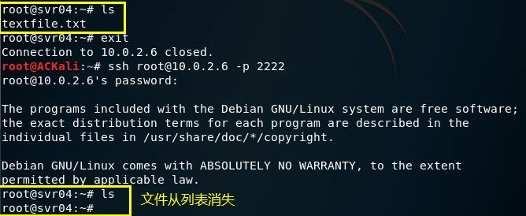
- `Cowrie`所有已经模拟实现的命令（还是挺多的），`base.py`中包含了常见命令`echo`、`ps`等的模拟实现：<br>

  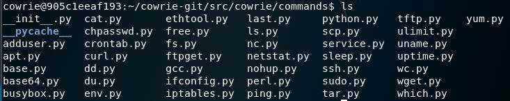

  - `~/cowrie-git/share/cowrie/txtcmds/bin/enable`文件内存储的信息对应`enable`命令的输出，与真实的`enable`命令的输出基本一致，但其中一些命令在蜜罐中无法使用，因此并不是记录蜜罐支持命令的文件

## 其它问题

### `pip3 install --upgrade pip`使用后`pip3`出现问题

- 使用`pip3`遇到的报错信息
  ```bash
  Traceback (most recent call last):
    File "/usr/bin/pip3", line 11, in <module>
      sys.exit(main())
  TypeError: 'module' object is not callable
  ```
- 在终端输入`hash -r pip`即可解决
  ```bash
  hash: hash [-lr] [-p 路径名] [-dt] [名称 ...]
    记住或显示程序位置。

    确定并记住每一个给定 NAME 名称的命令的完整路径。
    如果不提供参数，则显示已经记住的命令的信息。

    选项：
      -r		忘记所有记住的位置
  ```
- 当然，良好习惯是使用：`python -m pip`（~~啊，要打好多字~~）

## 实验总结

### 如何辨别当前目标是一个「蜜罐」

- 入侵时应当保持谨慎的态度，细心观察当前环境，并结合之前的使用经验进行比较分析
- 目标突破的难易程度也可以作为辨别的依据，过于简单或是利用常见漏洞就能进入的目标，可以在很大程度上怀疑其为蜜罐
- 如果蜜罐模拟得不够完善，多尝试几个命令，或添加一些选项，就会让其露出马脚
- 命令的返回也值得观察与分析，包括没进入蜜罐前的连接的返回信息
- 由于系统不会给蜜罐分配很多资源，当遇到需要与网络进行通讯时，可能会出现速度下降的情况

### 常见的蜜罐识别和检测方法

- 经验和直觉很重要
- 对低交互蜜罐的识别，主要集中在模拟技术的检测上
  - 通常存在着较为明显的特征
- 高交互蜜罐通常使用虚拟机进行部署，常用虚拟机探测技术进行识别
  - 虚拟机探测的目标：检查当前代码是否正运行在一台虚拟的主机上
    - 根据文件系统和注册表中的虚拟机信息探测
    - 根据虚拟主机的内存分配特征探测
    - 根据虚拟主机的硬件特征探测
    - 根据虚拟主机中的特殊指令与通道探测
- 高交互蜜罐通常采用内核级隐藏技术，主要有隐藏模块、隐藏文件、隐藏进程、隐藏连接等技术，可通过对隐藏技术的识别来进行判断
- 基于内核的 Sebek 组件用于捕获 SSH 和 SSL 加密的信息，常用于高交互蜜罐系统的数据捕获工具，可以对其进行检测。检测方法：
  - 查看反应时间
  - 观察网络传输计数器
  - 修改系统调用表
  - 查找隐藏模块

## 参考资料

- [twisted-honeypots](https://github.com/lanjelot/twisted-honeypots)
- [How to change from default to alternative Python version on Debian Linux](https://linuxconfig.org/how-to-change-from-default-to-alternative-python-version-on-debian-linux)
- [ssh error: unable to negotiate with IP: no matching cipher found](https://ma.ttias.be/ssh-error-unable-negotiate-ip-no-matching-cipher-found/)
- [docker-cowrie](https://github.com/cowrie/docker-cowrie)
- [pip v10 breaks Debian/Ubuntu pip3 command](https://github.com/pypa/pip/issues/5221#issuecomment-381568428)
- [docker-exec](https://manpages.debian.org/testing/docker.io/docker-exec.1.en.html)
