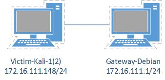
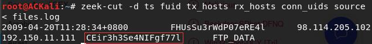
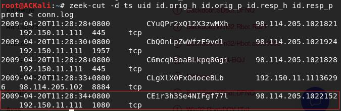
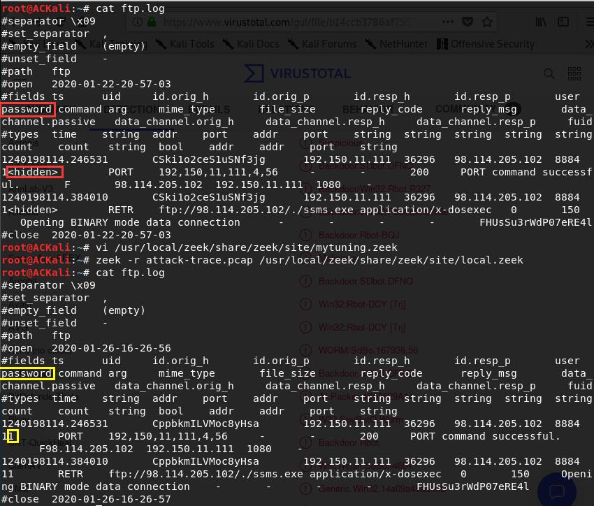

# 使用 zeek 完成取证分析

## 实验目的

- 通过 zeek 取证分析过程，理解计算机取证

## 实验过程

### 网络拓扑



### 安装 zeek

```bash
# install the required dependencies
apt update && apt-get install cmake make gcc g++ flex bison libpcap-dev libssl-dev python-dev swig zlib1g-dev

# Download Zeek
wget https://www.zeek.org/downloads/zeek-3.0.1.tar.gz

# Unzip
tar zxf zeek-3.0.1.tar.gz

cd zeek-3.0.1

# The typical way to build and install from source
./configure
make & make install

# Add to current user PATH
if [[ $(grep -c '/usr/local/zeek/bin' ~/.bashrc) -eq 0 ]];then echo 'export PATH=/usr/local/zeek/bin:$PATH' >> ~/.bashrc;fi

# For the PATH changes to take effects
source ~/.bashrc
```

### 实验环境基本信息


### 编辑 zeek 配置文件

- 编辑`/usr/local/zeek/share/zeek/site/local.zeek`，在文件尾部追加两行新配置代码
    ```bash
    @load frameworks/files/extract-all-files
    @load mytuning.zeek
    ```
- 在`/usr/local/zeek/share/zeek/site`目录下创建新文件`mytuning.zeek`，内容如下：
    ```bash
    # 避免丢弃没有有效校验和的数据包
    redef ignore_checksums = T;
    ```

### 使用 zeek 自动化分析 pcap 文件

```bash
# 下载提供的数据包
wget https://c4pr1c3.github.io/cuc-ns/chap0x12/attack-trace.pcap

zeek -r attack-trace.pcap /usr/local/zeek/share/zeek/site/local.zeek
# -r read from given tcpdump file
# load the local script for more detection
```

出现警告信息`WARNING: No Site::local_nets have been defined. It's usually a good idea to define your local networks.`


可以通过在`mytuning.zeek`添加一行变量定义语句来解决

```bash
# Victim-Kali-1(2)所在的子网
redef Site::local_nets = { 172.16.111.0/24 };
```

在`attack-trace.pcap`文件的当前目录下会生成一些`.log`文件和一个`extract_files`目录


在`extract_files`目录下有一个名为`extract-1240198114.648099-FTP_DATA-FHUsSu3rWdP07eRE4l`的文件，使用`file`查看发现这是`Windows`下的可执行程序

```bash
file extract-1240198114.648099-FTP_DATA-FHUsSu3rWdP07eRE4l
# extract-1240198114.648099-FTP_DATA-FHUsSu3rWdP07eRE4l: PE32 executable (GUI) Intel 80386, for MS Windows
```

将该文件上传到 [Virustotal](https://virustotal.com) 后，会发现匹配了一份[历史扫描报告](https://www.virustotal.com/gui/file/b14ccb3786af7553f7c251623499a7fe67974dde69d3dffd65733871cddf6b6d/detection)，根据报告中多数杀毒引擎的反馈，得知这是一个已知的后门程序：<br>


至此，就可以基于这个发现进行倒推，寻找入侵线索了。<br>
阅读`/usr/local/zeek/share/zeek/base/files/extract/main.zeek`的源代码，通过`on_add`函数了解到上述提取文件的文件名的最右一个`-`右侧对应的字符串`FHUsSu3rWdP07eRE4l`是`files.log`中的文件唯一标识。
```bash
function on_add(f: fa_file, args: Files::AnalyzerArgs)
        {
        if ( ! args?$extract_filename )
                args$extract_filename = cat("extract-", f$last_active, "-", f$source,
                                            "-", f$id);

        f$info$extracted = args$extract_filename;
        args$extract_filename = build_path_compressed(prefix, args$extract_filename);
        f$info$extracted_cutoff = F;
        mkdir(prefix);
        }
```
查看`files.log`，发现该文件提取自网络会话标识（`zeek`根据 IP 五元组（IP地址，源端口，目的IP地址，目的端口和传输层协议 ）计算出的一个会话唯一性散列值）为`CEir3h3Se4NIFgf77l`的 FTP 会话


由上述信息已经可以得知该PE文件来自IPv4地址为：`98.114.205.102`的主机

另外，根据网络会话标识在`conn.log`中可以找到对应的 IP 五元组信息<br>


## 实验总结

- 计算机取证技术主要包括：数据获取技术（主要的数据来源包括：存储介质和网络通信数据）、数据分析技术、计算机犯罪分析技术、数据解密技术、证据保管、证据完整性的实现技术以及反取证技术。本次实验主要涉及数据分析技术。
- 自动化工具真是太棒了！ XD
- 未加密的通信数据果然还是很危险 (⃔ *`꒳´ * )⃕↝

### Zeek 的一些技巧

- `ftp.log`中默认不会显示捕获的 FTP 登录口令，可以通过在`/usr/local/zeek/share/zeek/site/mytuning.zeek`中增加以下变量重定义来实现：
  ```bash
  redef FTP::default_capture_password = T;
  ```
  
- 使用`zeek-cut`更“优雅”的查看日志中关注的数据列
  ```bash
  # 查看conn.log中所有可用的“列名”
  grep ^#fields conn.log | tr '\t' '\n'

  # 按照“列名”输出conn.log中我们关注的一些“列”
  zeek-cut ts id.orig_h id.orig_p id.resp_h id_resp_p proto < conn.log

  # 将UNIX时间戳格式转换成人类可读的时间（但该方法对于大日志文件处理性能非常低）
  zeek-cut -d < conn.log
  ```
- 查看 Zeek 的超长行日志时的横向滚动技巧
  ```bash
  less -S conn.log
  ```
- 查看ASCII码对应的“可打印字符”：`echo -n -e '\x09' | hexdump -c`
- 使用awk打印给定日志文件的第N列数据：`awk -F '\t' '{print $3}' conn.log`

## 参考资料

- [Installing — Zeek User Manual](https://docs.zeek.org/en/stable/install/install.html)
- [Zeek - Frequently Asked Questions](https://www.zeek.org/documentation/faq.html)
